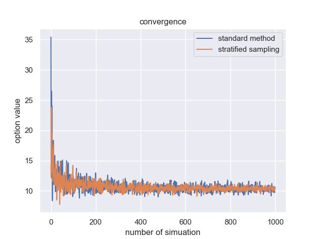

# Option-Pricing-with-LSMC-Method

Author: Zedong Chen  
Modify Date: Dec 18, 2023

The program simulates stock price based on the jump-diffusion model and pricing the American option using the Longstaff and Schwartz (2001) method, also called the least square monte carlo method. It also embedded the stratified sampling feature, one of the variance reduction techniques, into the simulating function to improve pricing efficiency. That is said, it simulates uniform random variables $u_{i}$ first and then simulates standard normal random variable $Z_{i}$ using $u_{i}$. In this way, it can improve sampling accuracy by reducing sampling error.   

I compared two simulation methods and analyzed the stratified sampling method's convergence advantage. By looking directly at the figure, the stratified sampling method converges to the "true" price faster than the simple method，resulting in a smaller variance in the whole process.  

  

Also, I used the pricing function to price the actual options traded on the market and compared simulated prices with real traded prices. For demonstration, I attached a figure showing the simulation's performance on both APPLE's call and put option will mature on March 15, 2024. I extracted implied volatility listed on the Yahoo Finance. The simulation went well; the simulated prices matched the mid price traded on the market. 

